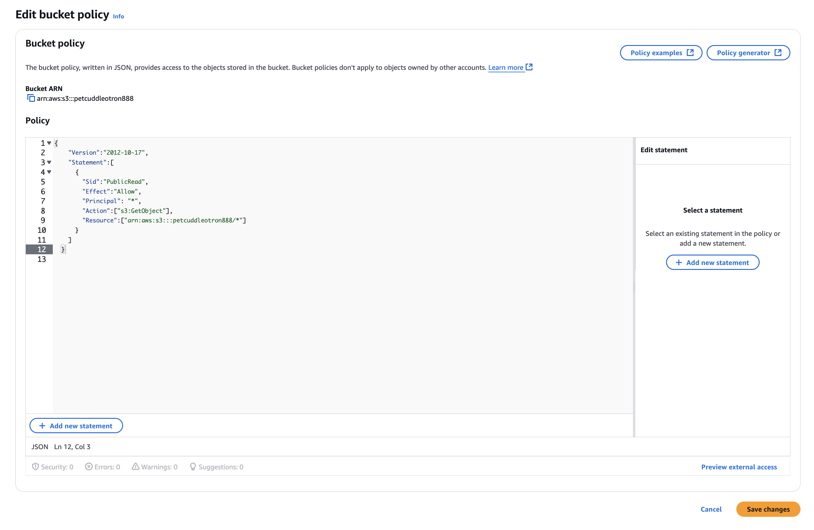

# Pet-Cuddle-o-Tron

### Description

The Pet-Cuddle-o-Tron application is designed to send automated emails reminding pet owners to cuddle their pets. Users can set a countdown timer and a custom message, and the application will handle the rest. This project is perfect for learning how to build serverless applications using AWS, integrating Simple Email Service (SES), Lambda functions, Step Functions, API Gateway, and S3.

### Features

* Email Notifications: Sends custom email reminders.
* Serverless Workflow: Utilizes AWS Step Functions to manage state transitions.
* Dynamic Timer: Configurable countdown for reminders.
* Static Web Frontend: Hosted on S3 with a simple UI for user interaction.

### Technologies Used
* AWS Simple Email Service (SES): For sending emails.
* AWS Lambda: To handle backend logic and trigger email sending.
* AWS Step Functions: For managing the state of the reminder workflow.
* AWS API Gateway: To expose RESTful endpoints for the frontend.
* AWS S3: Hosting the static frontend application.
* Python 3.11: Backend code written in Python.
* HTML, CSS, JavaScript: For the static frontend application.

# Architecture


# STAGES
## STAGE 1 - Configure Simple Email service


* Create 1st Email identity: **FROM**
    1. In configuration click `Identities` and click `Create Identities`
    
    2. Under *Identity type* Select `Email Address`, Enter the email address that come **FROM** the Pet Cuddle o Tron Application, and click `Create identity`
    
    3. Go to your email inbox and confirm that you are authorized to use the email address you entered
    

* Create 2nd Email identity: **TO**
    1. Follow steps 1-2 of `Create 1st Email identity: FROM`
        * Enter the email address that will delivered **TO**
        
    2. Repeat step 3 of `Create 1st Email identity: FROM`
        
* Finally, check the 2 `Verified` under *Identity status*


## STAGE 2 - Add an email lambda function to use SES to send emails for the serverless application
* Click 1-Click Deployment Link for the lambda role: [1-Click Deploy Link](https://learn-cantrill-labs.s3.amazonaws.com/aws-serverless-pet-cuddle-o-tron/lambdarolecfn.yaml)

* Move to IAM console

    1. Under *Roles* and click *Role name* starting with **LAMBDAROLE-LambdaRole**
    
        * check the `Trust relationships`: lambda assumes this role
        
        * check the `Permissions` policies: this lambda function can interact with 3 services: 
            * SES, SNS, and STATE machines inside *step functions*
        
        * It will also log all its logging diagnostics into CloudWatch Logs
        

* Move to Lambda console

    1. Click `Create a function`
    
    
    2. Configure the following:
        * Select `Author from scratch`
        * Under the *Function name*, enter `email_reminder_lambda`
        * Select Runtime to `Python 3.11`
        * Expand `Change default execution role`:
            * Select Use an `existing role`
            * In the Existing role dropdown, select Lambdarole
            * Click `Create function`
            
        

    3. Uder code
        * right click on `lambda_function.py` and click `open`
        
        * replace the skeleton code with:
        * and replace the REPLACE_ME with the `1st Email identity: FROM`. mine is ynnoriveracloud+cuddleotron@gmail.com

            ```
            import boto3, os, json

            FROM_EMAIL_ADDRESS = 'REPLACE_ME'

            ses = boto3.client('ses')

            def lambda_handler(event, context):
                # Print event data to logs .. 
                print("Received event: " + json.dumps(event))
                # Publish message directly to email, provided by EmailOnly or EmailPar TASK
                ses.send_email( Source=FROM_EMAIL_ADDRESS,
                    Destination={ 'ToAddresses': [ event['Input']['email'] ] }, 
                    Message={ 'Subject': {'Data': 'Whiskers Commands You to attend!'},
                        'Body': {'Text': {'Data': event['Input']['message']}}
                    }
                )
                return 'Success!'
        

        *  and click `deploy`
        

        * copy and note down the Function ARN. Mine is: arn:aws:lambda:us-east-1:861276109659:function:email_reminder_lambda
        


## STAGE 3 : Implement and configure the state machine, the core of the application
* Click 1-Click Deployment Link for the state machine role: [1-Click Deploy Link](https://learn-cantrill-labs.s3.amazonaws.com/aws-serverless-pet-cuddle-o-tron/statemachinerole.yaml)

    1. Once stack is completed, move to IAM console
    
        * Under `Roles`, Click Role name starting with *StateMachineRole* 
        
        * Under `Trust relationships`, verify that it is allowed to assume role with the AWS service, states
        
        * Click on `Permissions`
        verify that the permission of state machine can invoke the lambda functions and can directly interact with SNS
        

    2. Move to Step Functions console
    

        * Click `State machines`
        * Click `Create state machine`
        * Select `Blank`
        
        * Click `Code`
            * Paste JSON file:
            * Replace the `EMAIL_LAMBDA_ARN` with: `arn:aws:lambda:us-east-1:861276109659:function:email_reminder_lambda` 
                * note: this is different in every account
            ```
            {
            "Comment": "Pet Cuddle-o-Tron - using Lambda for email.",
            "StartAt": "Timer",
            "States": {
                "Timer": {
                "Type": "Wait",
                "SecondsPath": "$.waitSeconds",
                "Next": "Email"
                },
                "Email": {
                "Type" : "Task",
                "Resource": "arn:aws:states:::lambda:invoke",
                "Parameters": {
                    "FunctionName": "EMAIL_LAMBDA_ARN",
                    "Payload": {
                    "Input.$": "$"
                    }
                },
                "Next": "NextState"
                },
                "NextState": {
                "Type": "Pass",
                "End": true
                }
            }
            }

        

        * Click on Config
            * Details:
                * Replace State machine name: `PetCuddleOTron`
                * Select Type: `Standard`
            * Permissions:
                * Execution role: select `Choose an existing role` and Select role name starting with `StateMachineRole`
            * Logging:
                * Log level: `ALL`
            * Click `Create`

        

        

        * Locate and Copy `Arn`. Mine is `arn:aws:states:us-east-1:861276109659:stateMachine:PetCuddleOTron`
        


## STAGE 4 : Implement the API Gateway, API and supporting lambda function
1. Move to Lambda console
    

    * Click `Create function`
    * Select `Author from scratch`
    * Enter Function name: `api_lambda`
    * Select Runtime: `Python 3.11`
    * Expand `Change default execution role`
        * Click an `Use an existing role`
        * Select name starting `LAMBDAROLE` from the dropdodwn
        * Click `Create function`  

     
    * Under Code, right click `lambda_function.py`, and click open
        * delete and replace skeleton code with: 
        * Replace YOUR_STATEMACHINE_ARN with ARN from statemachine. Mine is: `arn:aws:states:us-east-1:861276109659:stateMachine:PetCuddleOTron`
        
            ```
            # This code is a bit ...messy and includes some workarounds
            # It functions fine, but needs some cleanup
            # Checked the DecimalEncoder and Checks workarounds 20200402 and no progression towards fix

            import boto3, json, os, decimal

            SM_ARN = 'YOUR_STATEMACHINE_ARN'

            sm = boto3.client('stepfunctions')

            def lambda_handler(event, context):
                # Print event data to logs .. 
                print("Received event: " + json.dumps(event))

                # Load data coming from APIGateway
                data = json.loads(event['body'])
                data['waitSeconds'] = int(data['waitSeconds'])
                
                # Sanity check that all of the parameters we need have come through from API gateway
                # Mixture of optional and mandatory ones
                checks = []
                checks.append('waitSeconds' in data)
                checks.append(type(data['waitSeconds']) == int)
                checks.append('message' in data)

                # if any checks fail, return error to API Gateway to return to client
                if False in checks:
                    response = {
                        "statusCode": 400,
                        "headers": {"Access-Control-Allow-Origin":"*"},
                        "body": json.dumps( { "Status": "Success", "Reason": "Input failed validation" }, cls=DecimalEncoder )
                    }
                # If none, start the state machine execution and inform client of 2XX success :)
                else: 
                    sm.start_execution( stateMachineArn=SM_ARN, input=json.dumps(data, cls=DecimalEncoder) )
                    response = {
                        "statusCode": 200,
                        "headers": {"Access-Control-Allow-Origin":"*"},
                        "body": json.dumps( {"Status": "Success"}, cls=DecimalEncoder )
                    }
                return response

            # This is a workaround for: http://bugs.python.org/issue16535
            # Solution discussed on this thread https://stackoverflow.com/questions/11942364/typeerror-integer-is-not-json-serializable-when-serializing-json-in-python
            # https://stackoverflow.com/questions/1960516/python-json-serialize-a-decimal-object
            # Credit goes to the group :)
            class DecimalEncoder(json.JSONEncoder):
                def default(self, obj):
                    if isinstance(obj, decimal.Decimal):
                        return int(obj)
                    return super(DecimalEncoder, self).default(obj)
        * Click `Deploy`
        

2. Move to API Gateway console
 

    * Create `REST API` by clicking `Build`
    
        * Select New API
        * Under API name, Enter `petcuddleotron`
        * Select API endpoint type to `Regional`
        * Select `Create API`
        
    * Create Resource
    
        * Enter Resource name: `petcuddleotron`
        * Make sure that Configure as proxy resource is **NOT** ticked - this forwards everything as is, through to a lambda function, because we want some control, we DONT want this ticked.
        * Towards the bottom MAKE SURE TO **TICK** `Enable API Gateway CORS`. This relaxes the restrictions on things calling on our API with a different DNS name, it allows the code loaded from the S3 bucket to call the API gateway endpoint. If you DONT check this box, the API will fail
        * Click `Create resource`
        
    * Create Method
        * click `Create method`
        
        * Method type: `POST`
            * this method is what the front end part of the application will make calls to.
            * Its what the api_lambda will provide services for.

        * Integration type: `Lambda function`
        * Tick `Lambda proxy integration`
            * this makes sure that all of the information provided to this API is sent on to lambda for processing in the event data structure.
            * if you don't tick this box, the API will fail
        * Make sure us-east-1 is selected for Lambda Region
        * Lambda function: enter *api*, and select the arn with *api*
        * Integration timeout:` 29000` (default)
        * Click `Create method`
        
    * Deploy API
        * click `Deploy API`
        * Stage: `New Stage`
        * Stage name and description: `prod`
        * Click `Deploy`
    
    * Copy and note down `invoke URL`. Mine is: `https://i6uqq1em9e.execute-api.us-east-1.amazonaws.com/prod`
    


## STAGE 5 : Implement the static frontend application and test functionality
1. Create the S3 Bucket
    * Move to S3 console
    
    * Click `Create bucket`
    * Enter Bucket name: petcuddleotron888
    * Untick `Block all public access`
    * Tick the box under `Turning off block all public access might result in this bucket and the objects within becoming public` to acknowledge you understand that you can make the bucket public.
    * Click `Create Bucket`
2. Set the Bucket as public
    * Click the bucket
    
    * Click the `Permissions` tab
        * In the `Bucket Policy`, click `Edit` 
        * Paste code below and replace `REPLACEME_PET_CUDDLE_O_TRON_BUCKET_ARN` with `Bucket ARN` (being careful NOT to include the /*)
        

            ```
                {
                "Version":"2012-10-17",
                "Statement":[
                {
                    "Sid":"PublicRead",
                    "Effect":"Allow",
                    "Principal": "*",
                    "Action":["s3:GetObject"],
                    "Resource":["REPLACEME_PET_CUDDLE_O_TRON_BUCKET_ARN/*"]
                }
                ]
            }

        * and `Save Changes`
        
    
3. Enable Static Hosting
    * click the bucket
    
    * click `Properties` Tab
    * Under `Static Website Hosting`, click `edit`
        * Under `Static website hosting` select `enable`
        * Under `Hosting type` select `Host a static website`
        * Foro both `index and error document`: `index.html` 
        * Click `Save Changes`
        * Under Bucket Website Endpoint copy and note down the bucket endpoint URL. Mine is `http://petcuddleotron888.s3-website-us-east-1.amazonaws.com`
    
4. Download and Edit The Front End Files
    * Download the folder in this repository named `serverless_frontend`. It has 4 items inside
        * index.html .. the main index page
        * main.css .. the stylesheet for the page
        * whiskers.png .. an image of whiskers !!
        * serverless.js .. the JS code which runs in your browser. It responds when buttons are clicked, and passes and text from the boxes when it calls the API Gateway endpoint.

    * Open the Javascript file in a code/text editor. Locate the placeholder
        * copy the `Invoke URL` from your API Gateway. Mine is: `https://i6uqq1em9e.execute-api.us-east-1.amazonaws.com/prod`
        * Replace the placeholder with the copied `Invoke URL`
            * add `/petcuddleotron` at the end it should look something like this `https://somethingsomething.execute-api.us-east-1.amazonaws.com/prod/petcuddleotron` Save the file.
        
        * `Save` the file

5. Upload and Test
    * Go back to S3 bucket:
        * Click `Upload`
        * Select the 4 files (updated js file), and click `Open`
        * Click `Upload`
         
    * Under `Static website hosting`, click the icon to open in a new tab
        
    * You will see the simple HTML and CSS stylesheet. When you click buttons, that calls the .js file which is the starting point for the serverless application 
    
    * Enter the Following:
        * To test the application Enter an amount of time until the next cuddle. For example, `120` seconds
        * Enter a message,  `HUMAN COME HOME NOW`
        * Then enter the PetCuddleOTron Customer Address in the email box, this is the email which you verified right at the start as the customer for this application.
    
## TEST
* before you do the next step and click the button on the application, if you want to see how the application works do the following
    * open a new tab to the Step functions console `https://console.aws.amazon.com/states/home?region=us-east-1#/statemachines`
    * Click on `PetCuddleOTron`
    * Click on the `Logging` tab, you will see no logs 
    
    * CLick on the `Executions` tab, you will see no executions
    


* return to the tab of S3 static website. Check the values you entered earlier.
    * Value: `120`
    * Message: `HUMAN COME HOME NOW!!!`
    * Email: enter the **2nd Email address: TO**: `ynnoriveracloud+cuddlecustomer@gmail.com`
    * Click `Email Minion` button

# OUTPUT
FINALLY!


* Got back to the `Step functions console` make sure the `Executions` Tab is selected 

* click the Refresh Icon Click the execution
Watch the graphic .. see how the Timer state is highlighted The step function is now executing and it has its own state ... its a serverless flow. Keep waiting, and after 120 seconds the visual will update showing the flow through the state machine

   * Timer .. waits `120` seconds
   * `Email` invokes the lambda function to send an email
   * `NextState` in then moved through, then finally END


* Scroll to the top, click `ExeuctionInput` and you can see the information entered on the webpage. This was send it, via the `JS` running in browser, to the API gateway, to the `api_lambda` then through to the statemachine


* Click `PetCuddleOTron` at the top of the page
* Click on the `Logging` Tab
    * Because the roles you created had `CWLogs` permissions the state machine is able to log to CWLogs Review the logs and ensure you are happy with the flow.
    


### Error Encountered:


1. Ensure the api_lambda code is pasted correctly and the correct ARN is entered.
   
2. If you still encounter the same error in `Firefox`, try reopening the S3 static website link in `another browser`.


#### Credits

This project is based on the AWS Serverless `Pet-Cuddle-o-Tron` tutorial from the `Solutions Architect Professional` course by `Adrian Cantrill`. Their comprehensive guides and learning resources have been instrumental in the development of this application.
